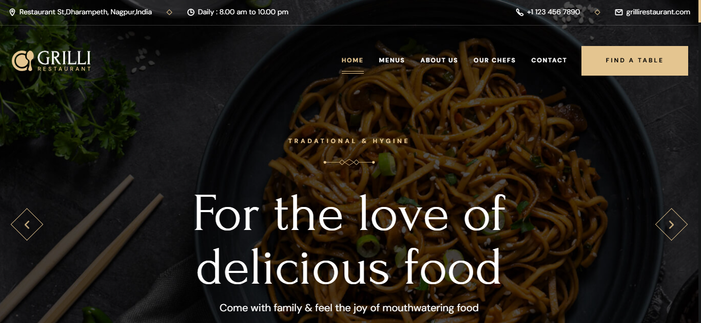
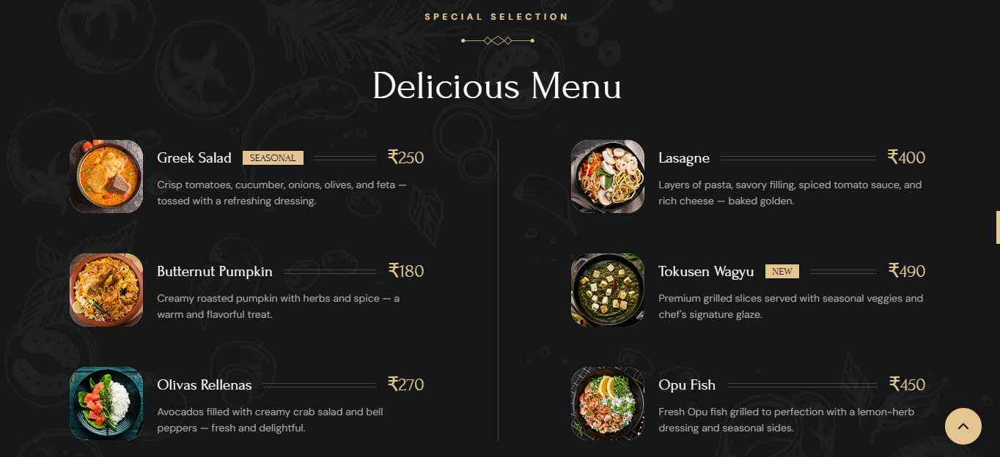
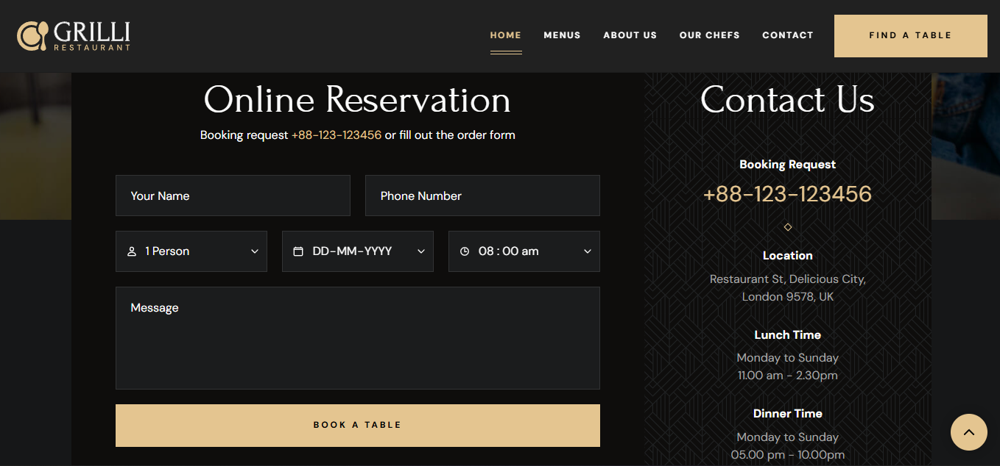
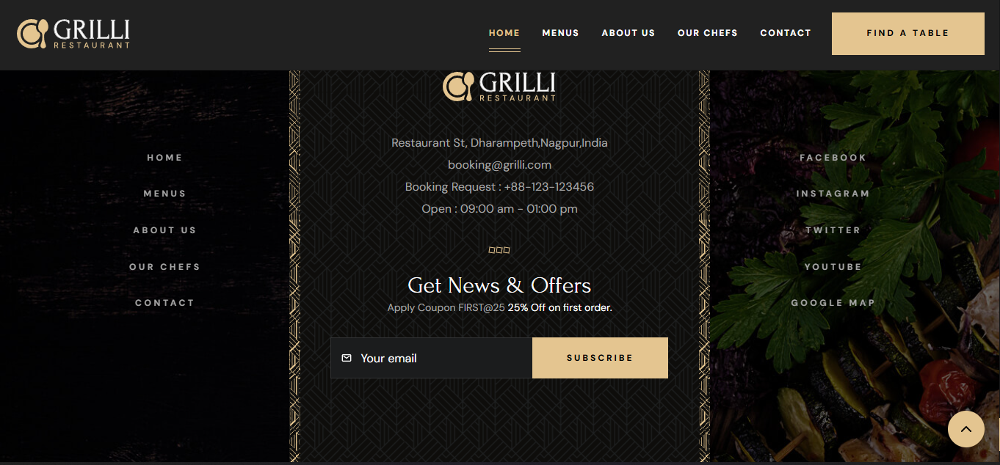

# 🍽️ Grilli Restaurant Website

Welcome to the official website of **Grilli Restaurant** — where taste meets elegance!  
This project is a modern and responsive restaurant website designed to showcase Grilli's signature dishes, special offers, and warm ambiance.

---

## 📌 Project Features

- 🍲 **Special Dishes Section** — Highlight your best-selling or seasonal plates  
- 🧾 **Delicious Menu** — Organized layout of your food & beverage offerings  
- 🏆 **Top Notch Service** — Emphasize quality, customer experience, and ambiance  
- 🕒 **Timings** — Clearly display opening and closing hours  
- 📍 **Reserving seats** — Easy reservation of seats for customers

---

## 🛠️ Technologies Used

- **HTML5**  
- **CSS3**  
- **JavaScript**  
- Custom **fonts, animations, and icons**

---

## 📸 Screenshots

Here are a few previews of the Grilli Restaurant website:

### 🏠 Homepage  
  
*A welcoming hero section with featured menu items and smooth animations.*

### 📋 Menu Section  
  
*A responsive grid layout showing featured dishes with prices and descriptions.*

### 🧾 Booking/Contact Section  
  
*A form for table reservations and contact information.*

### 📍 Footer  
  
*Includes address and social links.*

---

## 🧑‍💻 How to Clone

Follow these steps to run the website locally:

1. **Clone the repository**

   ```bash
   git clone https://github.com/your-username/grilli-restaurant.git
2. **Navigate to the project folder**
    ```bash
   cd grilli-restaurant
4. **Open the project in Visual Studio Code**
    ```bash
   code .
*For any queries, feel free to email me at siddhantrambhad234@gmail.com 📬*
